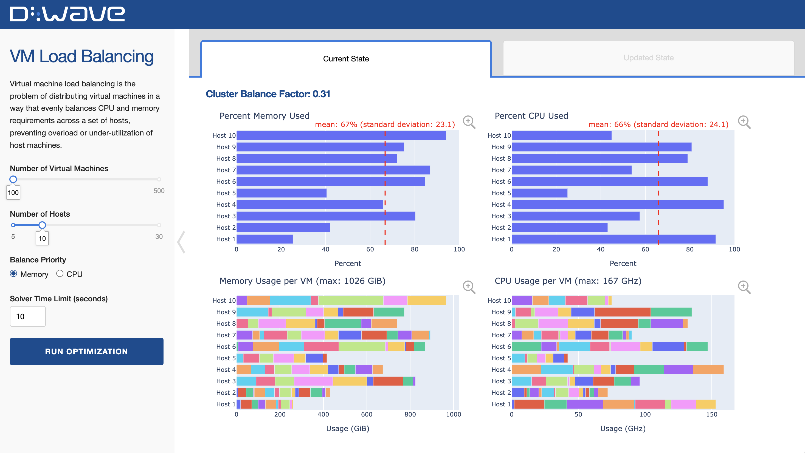

# Load Balancing

Virtual machine load balancing is the problem of distributing virtual machines in a way that
evenly balances CPU and memory requirements across a set of hosts, preventing overload
or under-utilization of host machines. It is a real-world problem for many organizations, 
including D-Wave.



## Installation
You can run this example without installation in cloud-based IDEs that support the
[Development Containers specification](https://containers.dev/supporting) (aka "devcontainers")
such as GitHub Codespaces.

For development environments that do not support `devcontainers`, install requirements:

```bash
pip install -r requirements.txt
```

If you are cloning the repo to your local system, working in a
[virtual environment](https://docs.python.org/3/library/venv.html) is recommended.

## Usage
Your development environment should be configured to access the
[Leap&trade; quantum cloud service](https://docs.ocean.dwavesys.com/en/stable/overview/sapi.html).
You can see information about supported IDEs and authorizing access to your Leap account
[here](https://docs.dwavesys.com/docs/latest/doc_leap_dev_env.html).

Run the following terminal command to start the Dash application:

```bash
python app.py
```

Access the user interface with your browser at http://127.0.0.1:8050/.

The demo program opens an interface where you can configure problems and submit these problems to
a solver.

Configuration options can be found in the [demo_configs.py](demo_configs.py) file.

> [!NOTE]\
> If you plan on editing any files while the application is running, please run the application
with the `--debug` command-line argument for live reloads and easier debugging:
`python app.py --debug`

## Problem Description

**Objective**: To balance the system such that each host has similar memory and CPU demands.

**Constraints**: (1) Each virtual machine can only be assigned to one host. (2) Total resource
demands on a single host must be less than or equal to the per-host proportional allocation 
of capacity.

## Model Overview

### Parameters
 - Hosts: Each with an ID, current CPU use, current memory use, CPU capacity, and memory capacity.
 - Virtual Machines: Each with an ID, CPU requirement, and memory requirement.
 - Priority: Whether to prioritize balancing CPU or memory.

### Variables
 - `{vm}_on_{host}`: Binary variable that shows if virtual machine is assigned to host.

### Objective
Our objective is to assign virtual machines to hosts such that the resource demands for CPU and
memory are equally distributed between hosts.

The `Priority` setting enables you to choose between prioritizing CPU or memory balancing. The
prioritized resource is set as a hard constraint while the other resource is a soft constraint.

The solution quality can be evaluated by the `cluster balance factor` metric. The cluster balance
factor is a weighted measure (based on the Priority setting) of how evenly memory and CPU resources
are distributed across hosts. A higher cluster balance factor (closer to 1) means the system is more
balanced.

### Constraints
#### One Host per Virtual Machine
Each virtual machine can only be assigned to one host. To accomplish this we use a one-hot
constraint for discrete `{vm}_on_{host}` variables.

#### Proportional Allocation
The sum of CPU and memory requirements on a host must be less than or equal to the
proportional allocation of the host. This proportional allocation is that host's resource 
capacity divided by the total resource capacity of all hosts multiplied by the total demand 
of all virtual machines.

The priority between resources (memory or CPU) is set with the `Balance Priority`, which
switches between hard and soft constraints for the two resources.


## License

Released under the Apache License 2.0. See [LICENSE](LICENSE) file.
